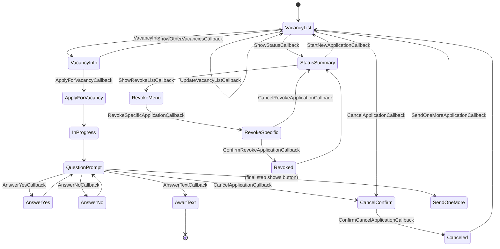

# Candidate Telegram Bot — Buttons-Only Flow

This diagram shows only user flows triggered by inline buttons (callback queries). Text commands and free-text answers are excluded, except where a button initiates text input.

Callback coverage in this flow:
- Vacancy listing: `vacancy_info`, `update_vacancies`, `show_others`
- Application start: `apply_for_vacancy`
- Answering: `answer_yes`, `answer_no`, `answer_text` (initiates text input)
- Cancel application: `cancel_app`, `confirm_cancel_app`
- Status and revoke: `show_status`, `revoke_list`, `revoke_specific`, `confirm_revoke_app`, `cancel_revoke_app`
- Start new / after complete: `start_new_app`, `send_one_more`

